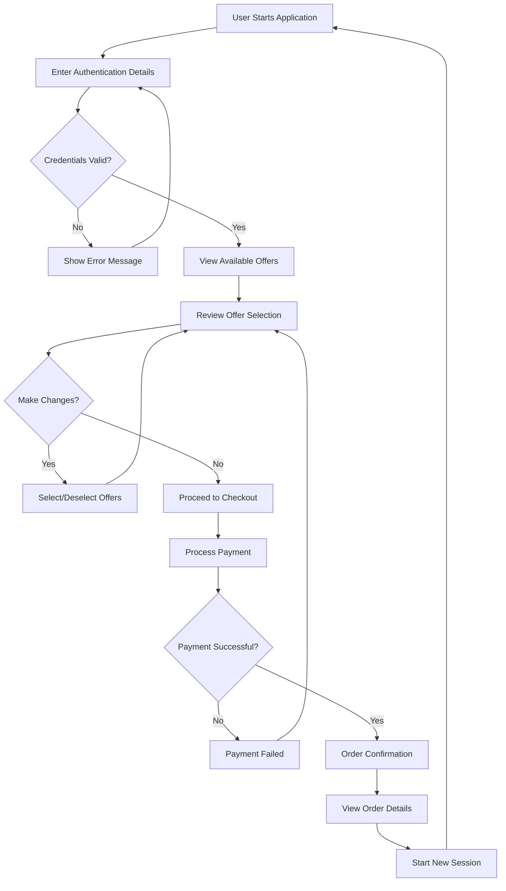
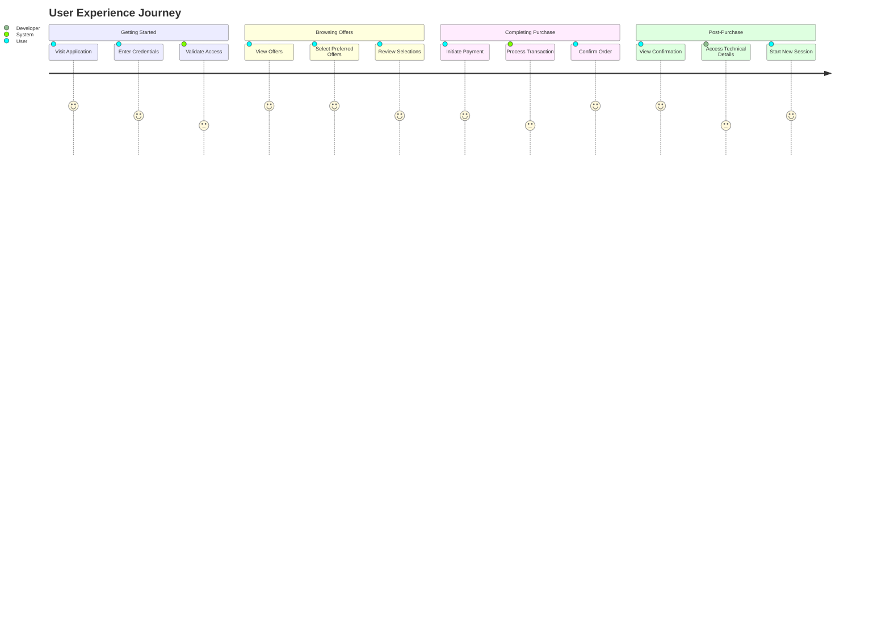
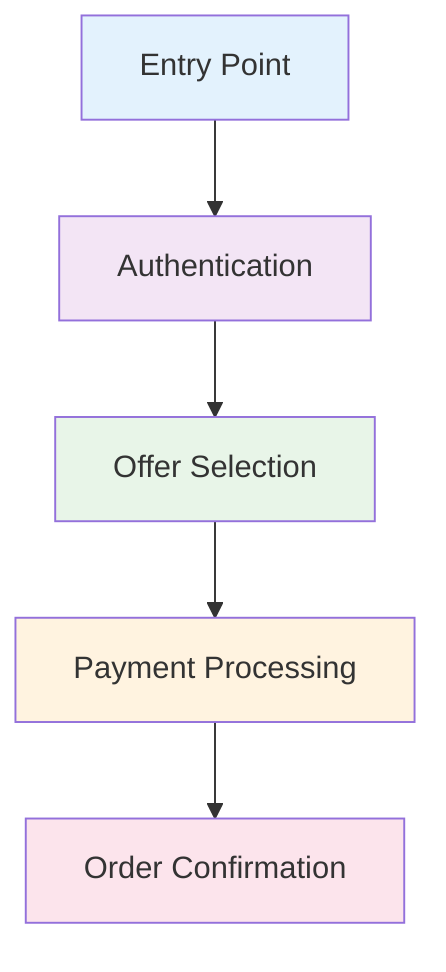
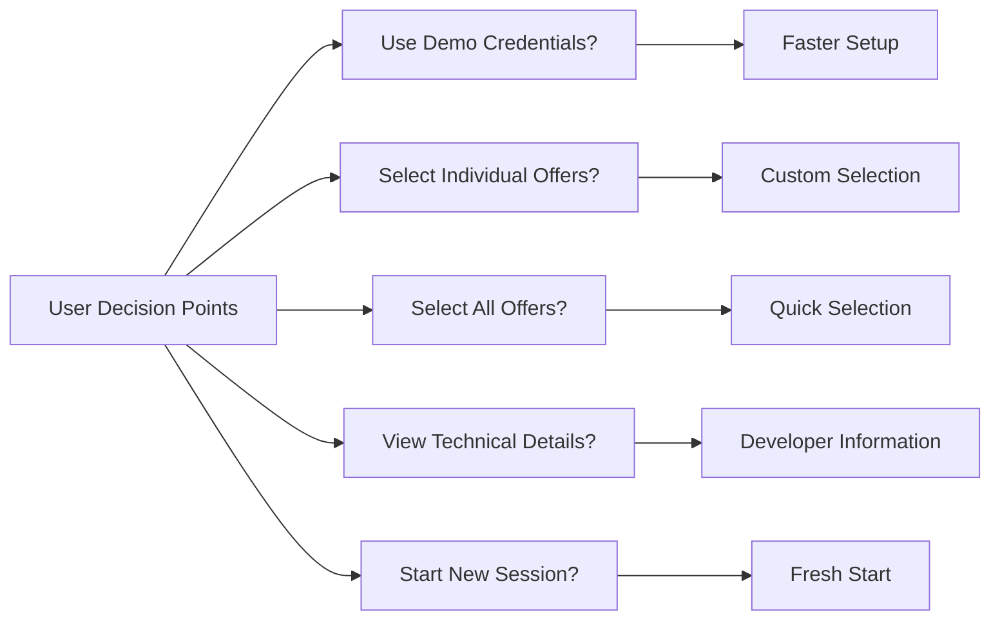
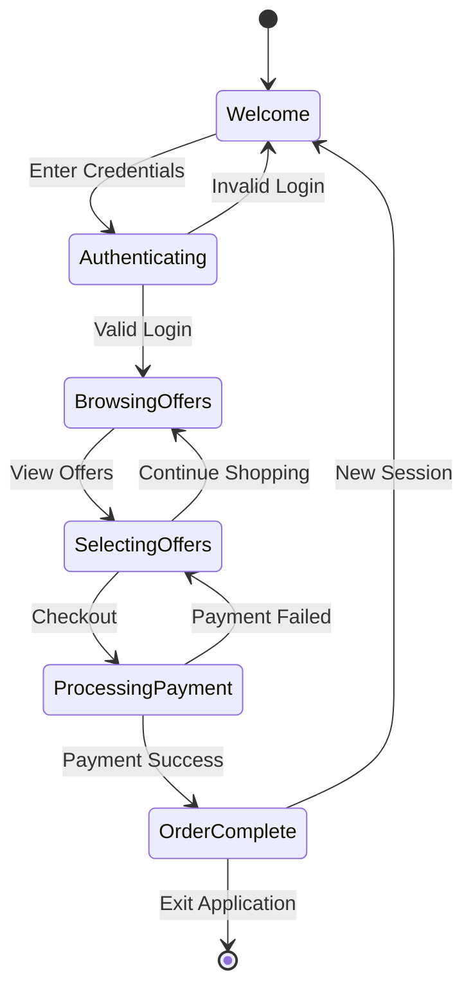
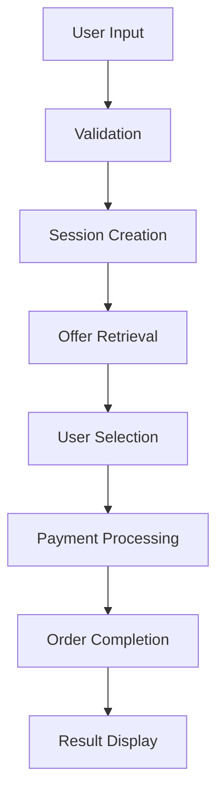
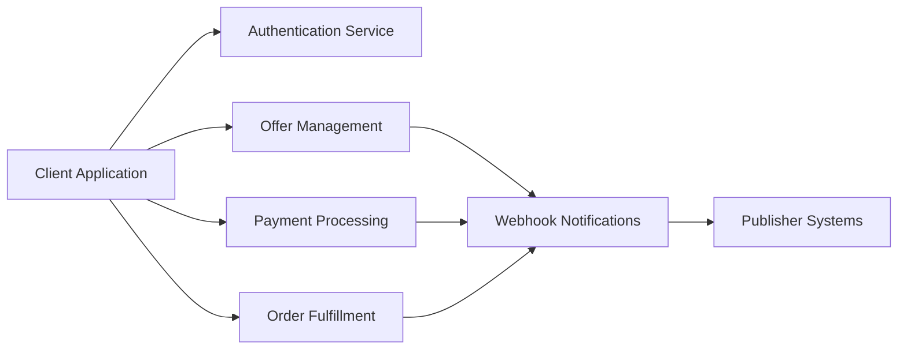

# USP Demo Application - General Flow Overview

## High-Level User Journey

## Simple Process Flow

## Core Components Overview

## Decision Points

## System States

## Data Movement

## Key Features Summary

### User Experience Features
- **Simple Authentication**: Quick credential entry with demo option
- **Visual Offer Selection**: Easy-to-use interface for browsing offers
- **Instant Feedback**: Real-time updates on selections and actions
- **Secure Processing**: Protected payment and data handling
- **Clear Confirmation**: Detailed order summary and next steps

### Technical Features
- **API Integration**: Seamless connection to offer management system
- **Error Handling**: Graceful recovery from issues
- **Session Management**: Persistent user state throughout journey
- **Developer Tools**: Technical monitoring and debugging capabilities
- **Documentation**: Comprehensive integration guidance

### Business Benefits
- **User Engagement**: Interactive offer selection process
- **Conversion Optimization**: Streamlined checkout experience
- **Technical Transparency**: Clear API documentation for integration
- **Scalable Architecture**: Supports multiple user sessions
- **Analytics Ready**: Comprehensive logging for business insights

## Integration Points

## Success Metrics

### User Journey Metrics
- **Authentication Success Rate**: Percentage of successful logins
- **Offer Engagement**: Number of offers viewed and selected
- **Conversion Rate**: Completed purchases vs. started sessions
- **User Satisfaction**: Smooth flow completion
- **Error Recovery**: Successful retry attempts

### Technical Performance
- **API Response Time**: Speed of offer loading and selection
- **Error Rate**: Frequency of technical issues
- **Session Completion**: End-to-end journey success
- **Integration Health**: Webhook delivery success
- **Documentation Usage**: Developer tool engagement

## Target Audiences

### End Users
- **Primary Goal**: Select and purchase relevant offers
- **Key Needs**: Simple interface, clear pricing, secure payment
- **Success Measure**: Successful order completion

### Developers
- **Primary Goal**: Understand integration requirements
- **Key Needs**: API documentation, testing tools, error handling
- **Success Measure**: Successful implementation

### Business Stakeholders
- **Primary Goal**: Evaluate platform capabilities
- **Key Needs**: User experience quality, technical reliability
- **Success Measure**: Platform adoption readiness
