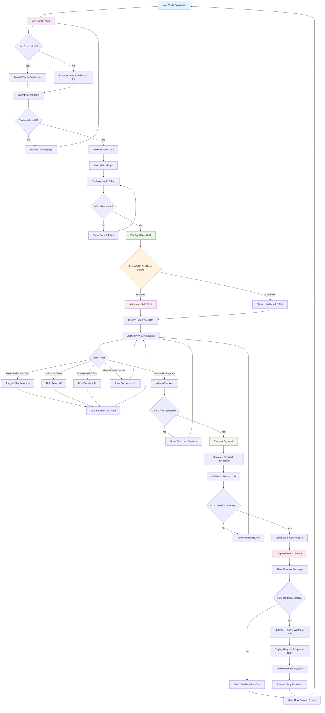
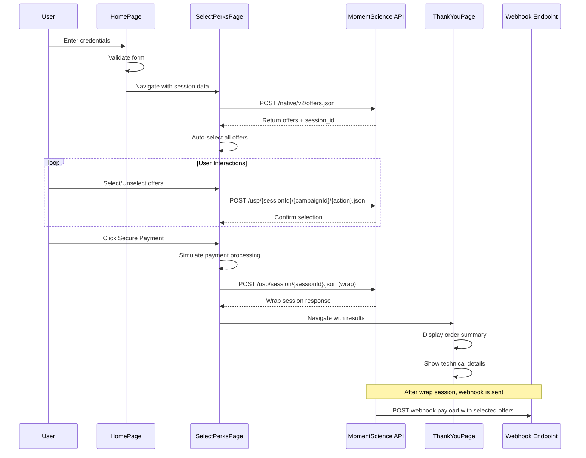
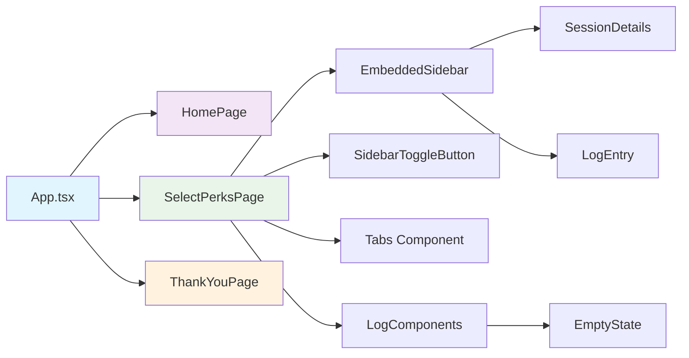
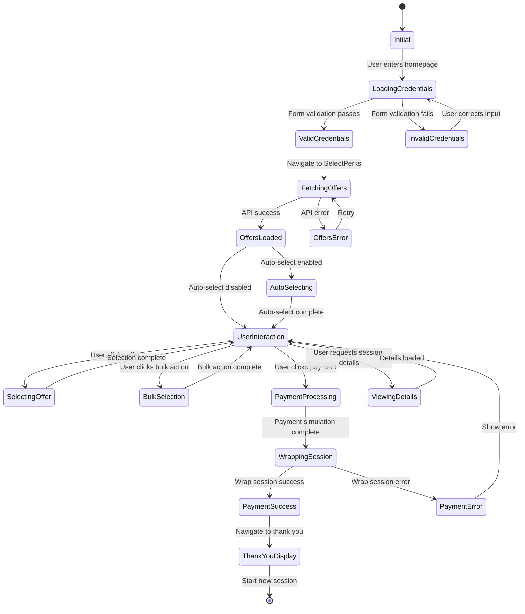
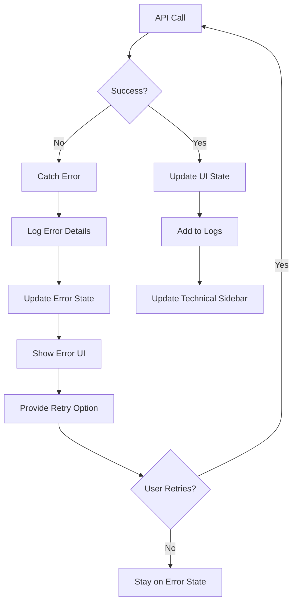
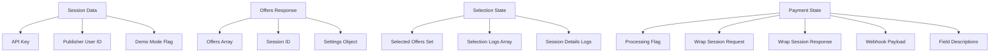

# MomentScience USP Demo - Complete Flow Diagram

## Application Flow Overview

## API Integration Flow

## Component Architecture

## State Management Flow

## Technical Integration Details

```mermaid
flowchart LR
    A[Payment Button Click] --> B[Set Payment Processing State]
    B --> C[Show Technical Sidebar]
    C --> D[Switch to API Logs Tab]
    D --> E[Simulate Payment Delay]
    E --> F[Execute Wrap Session API]
    
    F --> G[Create Webhook Payload]
    G --> H[Generate Field Descriptions]
    H --> I[Store API Request Details]
    I --> J[Store API Response Data]
    J --> K[Store cURL Commands]
    K --> L[Navigate to Thank You Page]
    
    L --> M[Display Order Summary]
    M --> N[Show Process Flow]
    N --> O[Display API Details]
    O --> P[Show Webhook Structure]
    P --> Q[Provide Copy Functionality]
    Q --> R[Show Field Documentation]
```

## Error Handling Flow

## Data Flow Structure

## Key Features Overview

### Authentication & Session Management
- Demo credential auto-fill
- Form validation with error handling
- Session data persistence in localStorage
- Secure API key management

### Offer Management
- Dynamic offer fetching from API
- Auto-selection capability
- Individual and bulk selection
- Real-time selection state updates

### Technical Integration
- Comprehensive API logging
- Request/response tracking
- cURL command generation
- Error handling and retry mechanisms

### Payment Processing
- Simulated payment flow
- Wrap session API integration
- Webhook payload generation
- Technical details documentation

### Developer Experience
- Embedded technical sidebar
- Real-time API monitoring
- Copy-to-clipboard functionality
- Detailed field documentation
